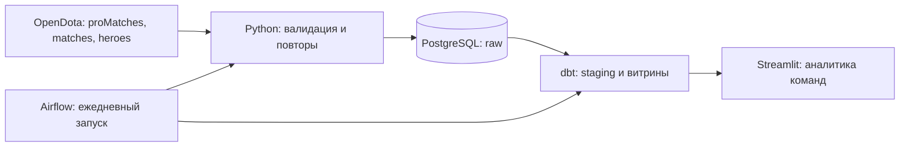

# dota2proleague

Проект по подтягиванию результатов tier-1 сцены Dota 2 и анализу профессиональных команд.

**Вопросы, на которые отвечает проект:** кого команда чаще пикает и банит, как выступает
против конкретных соперников и как отличаются её результаты на разных турнирах.

Источник — [OpenDota API](https://docs.opendota.com/). Сборщик получает JSON через публичный
API: отдельный HTML-парсинг для этих данных не требуется. Без `LEAGUE_IDS` собирается выборка
профессиональных турниров; для tier-1 нужно явно указать нужные турниры. В проекте нет
автоматической классификации турниров по уровню.



## Что внутри

- Python 3.12: клиент API с таймаутом, ограничением частоты, повтором 429/5xx,
  курсорной пагинацией и проверкой идентификаторов/результатов/драфтов.
- Airflow 3.3.1: DAG `dota2_pro_league`, ежедневно в **06:00 по Москве**, без автоматического
  backfill. Загрузка raw → `dbt build`, повторы задач и таймауты.
- PostgreSQL 16: оригинальные JSON-ответы, справочник героев, очередь ещё не загруженных матчей.
- dbt-postgres 1.9.1: результаты команд, пики/баны, соперники, тесты качества.
- Streamlit: команда, турнир, период, винрейт, герои, последние матчи, экспорт CSV.
- GitHub Actions: проверки Python, интеграционные тесты PostgreSQL/dbt, проверка Compose,
  сборка Airflow и проверка импорта DAG.

## Быстрый запуск

Нужны **Docker Desktop с Linux containers / WSL 2**, Docker Compose v2 и Python 3.12+.
Для контейнеров желательно выделить минимум 4 ГБ памяти. Выполняй команды из корня клона.

```powershell
python scripts/init_env.py
docker compose up -d --build
docker compose logs -f airflow
```

`init_env.py` создаёт `.env` со случайным паролем PostgreSQL и сохраняет существующий файл.
`.env` не попадает в Git. Пример настроек — `.env.example`. dbt установлен в отдельное
виртуальное окружение внутри образа, чтобы его зависимости не конфликтовали с Airflow.

Открой [Airflow](http://localhost:8080): пользователь `admin`. Сгенерированный пароль:

```powershell
docker compose exec airflow cat /opt/airflow/simple_auth_manager_passwords.json.generated
```

Включи DAG `dota2_pro_league` и нажми **Trigger** для первого сбора. После успешного
`build_marts` открой [дашборд](http://localhost:8501). Обновление данных в нём — кнопка
«Обновить данные». До первого `dbt build` дашборд показывает инструкцию.

Остановить сервисы с сохранением данных:

```powershell
docker compose down
```

Это локальный учебный стенд: Airflow запускается через `standalone`, UI доступен только
на localhost. Для production нужны отдельные сервисы Airflow, роли БД и управление секретами.
Пароли и токены не следует добавлять в репозиторий.

## Выбор tier-1 турниров

Посмотреть ID и названия турниров:

```powershell
docker compose exec airflow python -m dota_scout.cli leagues
```

В `.env` укажи `LEAGUE_IDS` через запятую, например `LEAGUE_IDS=12345,23456`
(**пример, не список реальных tier-1 турниров**), затем:

```powershell
docker compose up -d --force-recreate airflow
```

Фильтр применяется к новым загрузкам и очереди ожидания. Уже собранные турниры остаются
в базе и выбираются фильтром дашборда. В `MATCH_PAGES` задаётся число страниц списка
матчей за запуск, в `MATCH_LIMIT` — максимум запросов деталей (по умолчанию 3 и 50).
`OPENDOTA_API_KEY` необязателен; учитывай актуальные лимиты API для своего доступа.

## Демо без запросов к OpenDota

Сервисы и образы всё равно нужно первоначально скачать. После этого можно проверить
аналитику на двух **синтетических** матчах, не обращаясь к игровому API:

```powershell
docker compose exec airflow python -m dota_scout.cli demo
docker compose exec airflow /opt/dbt/bin/dbt build --project-dir /opt/project/dbt --profiles-dir /opt/project/dbt
```

В дашборде выбери `Demo Radiant`, турнир `Demo League (synthetic)` и период
**1–2 октября 2026**. Ожидаемый результат — 2 матча, 1 победа, винрейт 50%, Axe:
2 пика, 1 победа. Синтетические команды и турнир явно обозначены; не смешивай
эту выборку с реальными выводами. Повторная загрузка демо не создаёт дубли.

## Историческая загрузка

```powershell
docker compose exec airflow python -m dota_scout.cli sync --pages 10 --limit 100
docker compose exec airflow python -m dota_scout.cli sync --pages 10 --limit 100 --before <match_id>
docker compose exec airflow /opt/dbt/bin/dbt build --project-dir /opt/project/dbt --profiles-dir /opt/project/dbt
```

Замени `<match_id>` на числовой ID: курсор загружает матчи с меньшими ID.
Большие интервалы истории проходятся вручную последовательными курсорами.
Каждый запуск перечитывает последние страницы: при длительном простое или большом
числе матчей возможны пропуски, поэтому проект не обещает полную историю всех турниров.
Запускай ручной сбор после завершения DAG, чтобы не создавать лишние запросы к API.

## Модели данных

| Слой | Таблица | Одна строка |
|---|---|---|
| raw | pro_matches | Матч из списка профессиональных матчей |
| raw | match_payloads | Оригинальные детали матча |
| raw | heroes | Название героя |
| analytics | stg_matches | Матч, команды, турнир, исход, наличие драфта |
| analytics | stg_draft | Событие пика или бана |
| analytics | fct_team_matches | Матч с точки зрения одной команды |
| analytics | fct_team_draft | Событие драфта с точки зрения действующей команды |
| analytics | team_summary | Команда на турнире |
| analytics | hero_summary | Герой команды на турнире |
| analytics | opponent_summary | Команда против соперника |

Бан относится к **команде, сделавшей бан**. Винрейт героя считается только по его пикам.
Одна игра даёт две строки результатов, если известны обе команды. Неизвестные ID команд
не подменяются вымышленными: такие стороны исключаются из командных витрин.

## Надёжность и ограничения

- Первичные ключи и upsert защищают от дублей. Успешные ответы сохраняются по одному,
  поэтому ошибка следующего запроса не теряет уже загруженные матчи.
- Неудачные запросы остаются в очереди; задача завершается ошибкой, Airflow повторяет её.
- Матчи без драфта сохраняются. Для матчей последних 7 дней пустой драфт перепроверяется
  через 6 часов; после этого окна нужна ручная доработка для повторной обработки старых матчей.
- `has_draft` означает наличие хотя бы одного события. Частично заполненный драфт
  сейчас не распознаётся автоматически; статистика не гарантирует полное покрытие.
- API может не вернуть часть данных или вернуть их с задержкой. Все метрики относятся
  к собранной выборке. Малая выборка не доказывает преимущество команды или героя.
- Результаты считаются по **отдельным картам**, а не победам в сериях bo3/bo5.
- Схема и `dbt build` поддерживают повторный запуск. Здесь используется полная пересборка
  витрин; для большой истории следующий шаг — incremental-модели.

## Разработка и тесты

```powershell
python -m venv .venv
.\.venv\Scripts\Activate.ps1
python -m pip install -e . ruff
python -m unittest discover -s tests -v
ruff check src dags dashboard scripts tests
```

Без PostgreSQL интеграционные тесты пропускаются. В GitHub Actions они запускаются
на отдельной тестовой базе и проверяют идемпотентность загрузки, пересборку dbt,
правильный винрейт и различие пиков/банов. Никогда не запускай их на рабочей базе.
Демонстрационный набор находится в `tests/fixtures/demo.json`.

Дополнительные детали — [docs/architecture.md](docs/architecture.md).

## Источники и документация

- [OpenDota API](https://docs.opendota.com/)
- [Публичные интерфейсы Airflow 3](https://airflow.apache.org/docs/apache-airflow/stable/public-airflow-interface.html)
- [Simple Auth Manager](https://airflow.apache.org/docs/apache-airflow/stable/core-concepts/auth-manager/simple/index.html)
- [Настройка dbt с PostgreSQL](https://docs.getdbt.com/docs/local/connect-data-platform/postgres-setup)

Проект не связан с Valve или OpenDota. Не распространяет реплеи и игровые ресурсы.
